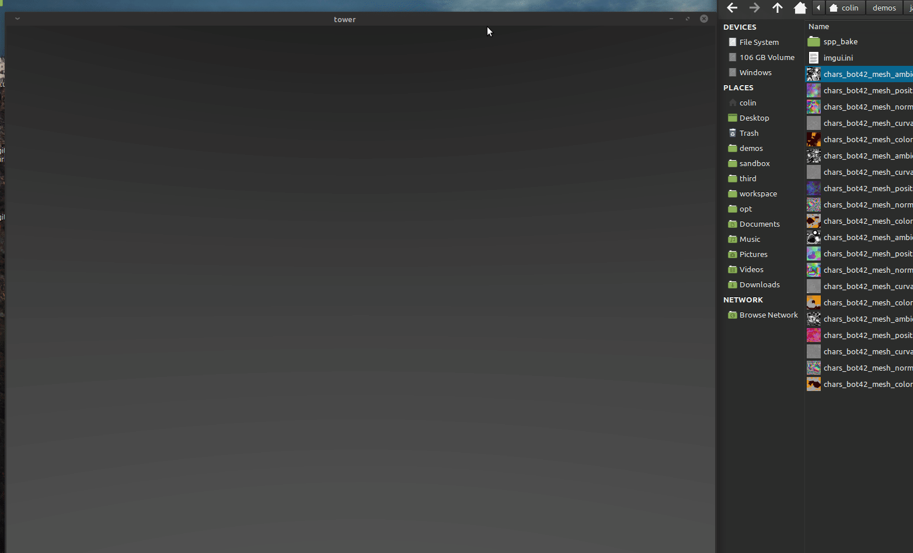

[](https://github.com/col-one/tower-view)

# TOWER VIEW

Tower View is a multi image viewer made with rust and powered by Amethyst.
The purpose of Tower is to offert a simple, light and perfomant image viewer with
a bunch of features adapted to the CG world and digital creation.

Tower-0.0.1 is perfect to show casing your texture maps or compare and reviewing images.

Features Tower-0.0.1 : 

* [x] Load images from CLI `tower <image_path>...`
* [x] Display 8bit images
* [x] Display several images as same time
* [x] Move the active image with alt + drag
* [x] Arrange the images as atlas on the board with key l
* [x] Delete the active image from the view board with key del
* [x] Bring the active image to front, on top of each other with key shift + t
* [x] Adjust channels values with shift + c
* [x] Change active image to the next one present in the current directory with arrow key letf / right
* [x] Caching in background of the images present in the current directory
* [x] Translate camera view with spacebar + drag 
* [x] Keep ratio of the camera when window size change
* [x] Camera view zoom in / out with ctrl + drag
* [x] Center camera and cursor when double click, handy to focus a precise image point
* [x] Camera fit the active image with key f
* [x] Camera fit all the images with shift + f
* [x] Camera fit the real image size with key s


Major features Tower-0.0.2 : 

* [ ] Display 16f and 32f images
* [ ] Support OpenExr format
* [ ] Create a tower file format, to save the tower scene
* [ ] Create a file settings
* [ ] Better performance managing


Long run features : 
* [ ] Support OCIO
* [ ] Display 3d objects
* [ ] Add timeline
* [ ] Read images sequences
* [ ] Read various video format

### Build tower from source : 
After installed correctly rust, https://www.rust-lang.org/tools/install
```
git clone https://github.com/col-one/tower-view.git
cd tower
cargo build --release
```
Run tower from target directory 
```
target/release/tower some_image_paths
```


## Basic manipulation
There is no "selection" concept with TowerView but an "active" concept, **the active image is the first image under the mouse cursor.**

- `drag and drop` an image file to add it the scene:

[](wiki/images/tower-drag-one.gif)
- `ctrl + click drag` to zoom in/out:
- `space + click drag` to pan the view:
- `f key` to focus the view on the active image:
- `shift + f key` to focus the view on the whole set of images:
- `s key` to set the view at 100%, the real size of images:
- `del key` to delete the active image:


